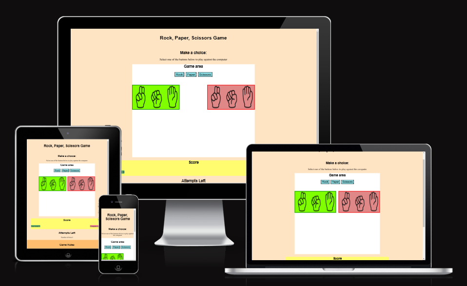
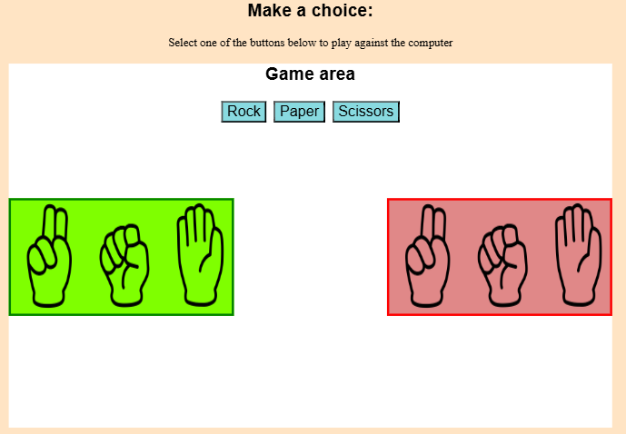
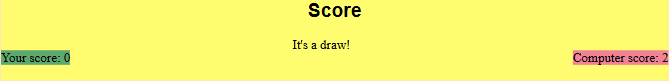
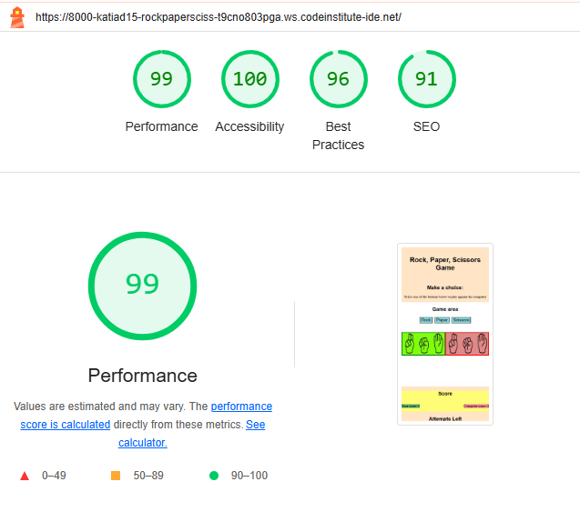

# Rock, Paper, Scissors Game

Rock, Paper, Scissors Game is a website that is aimed to people who like the world of games.
It is a game written using JavaScript programming, fully responsive that allows the user to play against the computer in a limit of five moves each round.

## Features

-_Header_

- The main page includes title: 'Rock, Paper, Scissors Game', where the user easily understands that the website is a game.

-_Game area_

- It is made up of three buttons, where the user selects a button depending on the option they want to use to play,which can be rock, paper or scissors. Two images appear below the buttons, in two colors: green for the user and red for the computer.

-_Score_

- Section that contains the scores of the respective players and that changes as the game progresses.

- At each game's round, a text appears showing the result of the round, that can be : win, lose. draw' depending of the maiden choices.

-_Attempts Lefts_

- Section composed of the number of game attempts that the user has, in this case five and which decreases throughout the game.

-_Game Rules_

- The footer is the part where the rules of the game are mentioned:
  - Rock breaks scissors
  - Paper wraps rock
  - Scissors cuts paper

  

## Testing

- I confirmed that the game results are always correct.
- I confirmed that this project is responsive, looks good and functions on all standard screen sizes using the devtools device toolbar.
- I confirmed that the colors and fonts choosen are easy to read and accessible by running it through lighthouse in devtools.

### Bugs
  Solved bugs
- While I was testing the game, it always started with computer picking two choices at once. After searching I found that "HTML "onclick" and JavaScript "Event Listeners" "  were conflicting each other. I opted to remove "onclick" from HTML.

### Validator Testing

- HTML
    - No errors were found when passing through the official [W3C HTML validator](https://validator.w3.org/nu/#textarea)

- CSS 
    - No errors were found when passing through the official [(W3C CSS validator (Jigsaw))](https://jigsaw.w3.org/css-validator/#validate_by_input)
    
- JavaScript
  - No errors were found when passing through the official [(JSHint JavaScript Validator)](https://jshint.com/)
     - The following metrics were returned:
     - There are 13 functions in this file.
     - Function with the largest signature take 2 arguments, while the median is 0.
     - Largest function has 20 statements in it, while the median is 8.
     - The most complex function has a cyclomatic complexity value of 8 while the median is 1.

### Unfixed Bugs
    No unfixed bugs were found.

## Deployment

- The site was deployed to Github pages.
- The steps to deploy are:
  - Go to the respective repository on GithHub
  - Go to the Settings
  - Scroll down to the 'Pages' section
  - In 'Source' select the branch and the root folder
  - Click on Save

  The live link can be found here: (https://katia-d15.github.io/rock-paper-scissors-game/)

## Credits

### Content

- The styles instructions to make game was taken from: Ultimate Rock, Paper, Scissors.

### Media

- The images used on the page was taken from the web site:[(Vecteezy)](https://www.vecteezy.com/vector-art/3027817-rock-paper-scissors-hand-gesture)
